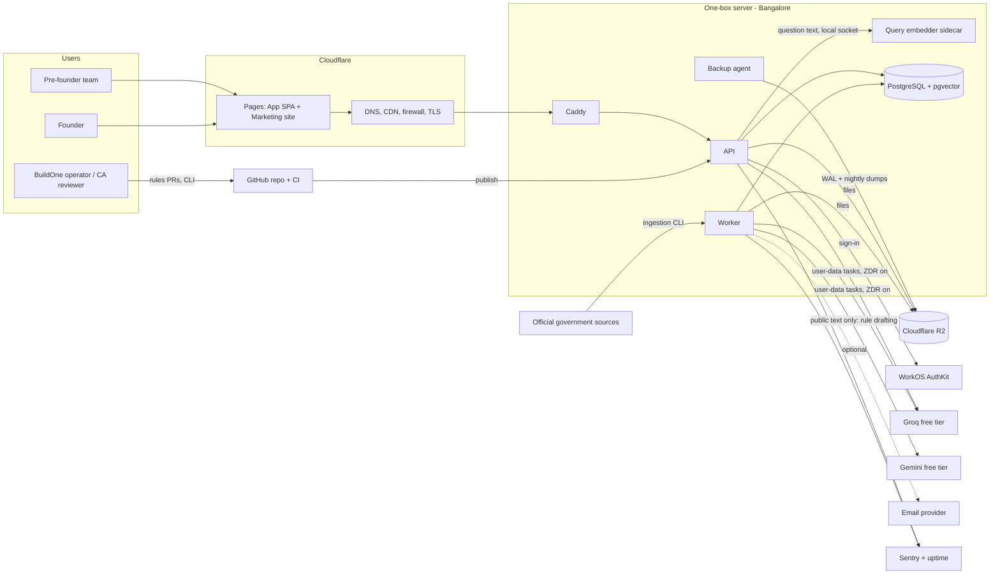
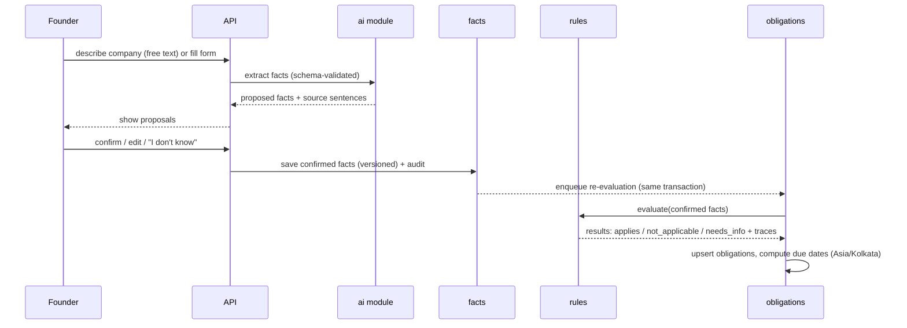

# BuildOne — System Architecture

> **Status:** Draft v0.2 · 2026-09-28 (revised for ₹0 one-box MVP) · Owner: @harshith769
> Technology choices and their reasons are in [tech-stack.md](tech-stack.md) and [adr/](adr/). Table-level design: [data-model.md](data-model.md); rule format: [rules-engine.md](rules-engine.md); ingestion and retrieval: [data-pipeline.md](data-pipeline.md); AI: [ai-system.md](ai-system.md); deployment: [deployment.md](deployment.md).

**What this document answers**
- What the system's parts are and how they connect to external services
- How the backend is divided into modules and which dependencies are allowed
- How the key flows work end to end (intake → obligations, explainer, copilot, rule publication, reminders, document check)
- How the system is deployed now, and how it scales later
- What happens when a dependency fails

---

## 1. Design principles

1. **Deterministic core, AI at the edges.** Obligations come from rules evaluated on confirmed facts. AI proposes facts, drafts rules, explains, and answers — it never decides applicability.
2. **Core works without AI.** If every AI provider is down, obligations, calendar, and reminders still work ([NFR-AVL-02](nfr.md#2-availability-and-reliability)).
3. **Everything cited, everything versioned.** Rules, prompts, models, and source documents are versioned; every output records the versions that produced it.
4. **Tenant isolation twice.** Application-level scoping plus Postgres Row-Level Security.
5. **Modular monolith.** Strict module boundaries inside one deployable ([ADR-0001](adr/0001-modular-monolith.md)).
6. **Idempotent jobs.** Every background job can run twice safely.
7. **Portable at every boundary.** Standard Postgres, Docker, S3 API, OIDC, one AI gateway; provider-specific services are banned in application code ([ADR-0011](adr/0011-portability-rules.md)).
8. **Never auto-spend.** Free-tier limits degrade features; they never trigger paid usage ([ADR-0008](adr/0008-llm-gateway-provider-agnostic.md)).

---

## 2. System context



Trust boundaries: browser ↔ Cloudflare ↔ API (public); API/worker ↔ database (private network); outbound calls to identity, AI, and email providers (third-party processors listed in the privacy notice, [NFR-PRV-06](nfr.md#6-privacy-and-data-protection)).

---

## 3. Backend modules

### 3.1 Module map

| Module | Owns | Exposes |
|---|---|---|
| `platform` (shared kernel) | Config, DB session, UUIDv7 IDs, clock, logging, errors, request context | Utilities only — no business logic |
| `identity` | Users, sessions, identity-provider callback | Current user, session management |
| `tenancy` | Organisations, memberships, roles, invitations (CA grants in v1) | Authorization checks, org context |
| `audit` | Append-only audit log | `record(event)` |
| `facts` | Fact schema, fact values, proposals, history | Confirmed facts for an org |
| `rules` | Published rule versions, evaluator | `evaluate(facts) → results + traces` |
| `obligations` | Obligation instances, status, calendar feed | Obligation plan for an org |
| `knowledge` | Sources, versions, chunks, embeddings, retrieval | `search(query, filters) → cited chunks` |
| `ai` | Gateway, prompt registry, schema validation, citation verification, cost tracking | `run(task, inputs) → validated output` |
| `explainer` | Explanation cache | Explanation for (org, obligation) |
| `copilot` | Conversations, routing, quotas, feedback | Chat API (streaming) |
| `documents` | Uploaded personal documents, extraction results | Upload, extract, delete |
| `launchpad` | Team situation profiles, Situation Check, Launch Roadmap, incorporation handoff | Launchpad API |
| `notifications` | Preferences, reminder scheduling, email sending | Notification jobs |

### 3.2 Allowed dependencies

A module may call only the **public service interface** of the modules listed; it never touches another module's tables. Enforced by `import-linter` in CI ([NFR-MNT-02](nfr.md#10-maintainability-and-observability)).

| Module | May depend on |
|---|---|
| `identity` | platform |
| `tenancy` | platform, identity, audit |
| `facts` | platform, tenancy, audit, ai |
| `rules` | platform, knowledge (citations only) |
| `obligations` | platform, tenancy, audit, facts, rules |
| `knowledge` | platform, ai (embeddings) |
| `ai` | platform |
| `explainer` | platform, tenancy, obligations, rules, knowledge, ai |
| `copilot` | platform, tenancy, obligations, knowledge, ai, explainer |
| `documents` | platform, tenancy, audit, ai |
| `launchpad` | platform, tenancy, audit, facts, rules, documents |
| `notifications` | platform, tenancy, obligations |

Note that `rules` and `obligations` do **not** depend on `ai`, and `explainer` uses `ai` only for the optional rephrasing — this is what keeps the core working without AI.

---

## 4. Repository layout

```
buildone/
├── AGENTS.md                 # instructions for coding agents
├── CLAUDE.md                 # Claude Code bridge → AGENTS.md
├── .claude/                  # path-scoped rules + permission settings
├── Makefile                  # all developer commands
├── docs/                     # this documentation set
├── backend/
│   ├── pyproject.toml        # uv-managed dependencies
│   ├── app/
│   │   ├── main.py           # API entry point (FastAPI app factory)
│   │   ├── worker.py         # worker entry point (job queue + schedules)
│   │   ├── platform/         # shared kernel
│   │   └── modules/
│   │       └── <module>/
│   │           ├── api.py        # HTTP routes (thin)
│   │           ├── service.py    # public interface for other modules
│   │           ├── models.py     # SQLAlchemy tables (private to module)
│   │           ├── schemas.py    # Pydantic request/response models
│   │           └── jobs.py       # background tasks
│   ├── migrations/           # Alembic, reviewed SQL
│   └── tests/
│       ├── unit/ integration/ e2e/
│       └── tenancy/          # cross-tenant isolation tests
├── rules/
│   ├── schema/rule.schema.json   # JSON Schema for rule files
│   ├── published/<domain>/<rule_id>.yaml
│   ├── drafts/                   # AI-drafted, never published directly
│   ├── examples/                 # illustrative format examples (not legal content)
│   ├── facts.yaml                # fact registry
│   └── scenarios/                # CA-verified company scenarios + expected obligations
├── knowledge/
│   ├── sources.yaml          # registry of official sources + metadata
│   └── ingestion/            # CLI: fetch → parse → chunk → embed → load
├── evals/                    # golden sets + runners for AI quality gates
├── frontend/
│   ├── app/                  # React + Vite SPA
│   └── site/                 # Astro marketing + free tools
├── infra/
│   ├── compose/              # docker-compose: local = production one-box topology
│   ├── postgres/             # Postgres + pgvector + wal-g image; initdb roles/extensions
│   ├── caddy/                # reverse proxy config (Cloudflare-only origin)
│   ├── backup/               # wal-g config, nightly dump job, restore script
│   └── scripts/              # provision-and-restore script for a fresh server
└── .github/workflows/        # CI: lint, types, tests, evals, build, deploy
```

---

## 5. Key flows

### 5.1 Intake → obligations (deterministic core)



- Unknown facts produce `needs_info`, never silent exclusion (FR-CORE-03).
- Evaluation traces record which conditions matched with which fact values — the Explainer renders these.

### 5.2 Explainer

1. **Deterministic (default, no AI):** load the obligation's rule trace → fill the rule's CA-approved summary and "what to do" template with the company's matched fact values → attach required documents, penalty text, and citations to exact source spans. Same inputs → same text.
2. **Optional "Explain in simpler words":** check daily AI budget → `ai.run("rephrase")` grounded only in step 1's text and cited spans → citation verification (drop unsupported sentences; fall back to step 1 if nothing survives) → cache per (org, rule version, relevant-facts hash).

### 5.3 Copilot

1. Check organisation daily quota and global daily AI budget; if exhausted → "Daily limit reached — try tomorrow" with links to the obligation plan.
2. Classify route: `determination` → obligation plan (no generation of facts) · `explanation` → Explainer · `what_if` → v1 message · `interpretive` → step 3 · `out_of_scope` → professional referral.
3. Rewrite query with minimal relevant facts (state, entity type, headcount band) — no personal identifiers.
4. Hybrid retrieval with metadata filters (jurisdiction, effective date) → fusion → optional rerank.
5. If retrieval confidence below threshold → abstain.
6. Generate with citations → verify → stream to user; store versions, cost, and feedback.

### 5.4 Rule publication

```
Draft (AI CLI) → PR with YAML + reviewer fields → CI: schema check, unit tests,
scenario suite (recall gate) → merge → publish job: insert immutable rule versions
→ find affected orgs → enqueue re-evaluation → changelog entry
```

### 5.5 Reminders

- Daily scheduled job finds obligations crossing T-7, T-1, and overdue thresholds and creates in-app notifications (and emails, if the email channel is enabled).
- The ICS calendar feed is generated on request from current obligations, so the user's calendar app delivers reminders with no email dependency.
- Each notification uses a unique key `(obligation_id, reminder_type, channel, due_date)`; a unique constraint prevents duplicates across retries (FR-CORE-06).

### 5.6 Situation Check document

1. Client requests a signed upload URL → uploads directly to private object storage.
2. Worker validates type/size, (PAID: malware scan), extracts text.
3. `ai.run("clause_extract")` with document text as delimited data → schema-validated clauses with page/section locations.
4. Low-confidence results are labelled as not reliably identified.
5. Results visible only to the uploader unless shared; deletion removes file and derived data.

### 5.7 Launchpad → incorporation handoff

Owner triggers handoff → new `company` organisation created → team members invited with mapped roles → shared facts copied as **proposals** requiring confirmation in the new organisation.

---

## 6. Cross-cutting conventions

| Concern | Convention |
|---|---|
| IDs | UUIDv7 for all primary keys and public IDs |
| Time | `timestamptz` in UTC for events; **`date`** for legal due dates, interpreted in `Asia/Kolkata` |
| Money | Integer paise (`BIGINT`) |
| Tenancy | `org_id` on every tenant table; RLS policy per table; request sets org context on the DB session |
| Deletion | Soft delete + scheduled hard delete (30 days) for personal data |
| Idempotency | Unique keys for jobs and notifications; idempotency key header on retry-prone POSTs |
| Transactional enqueue | Jobs enqueued in the same DB transaction as the change that caused them (Postgres-backed queue) |
| Versioning | Rule version, prompt version, model ID, source version stored on every derived record |
| Errors | Problem-details JSON (`application/problem+json`) with request ID |

---

## 7. Deployment topology

### 7.1 MVP: one-box

```
Browser ─► Cloudflare (DNS, CDN, firewall, TLS)
             ├─► Cloudflare Pages: app.<domain> (SPA), <domain> (Astro site)
             └─► api.<domain> ─► ONE server (host per ADR-0012, Proposed), Docker Compose
                                   ├─ Caddy (accepts Cloudflare IPs only)
                                   ├─ api (Uvicorn workers)
                                   ├─ worker (queue + schedules)
                                   ├─ embedder sidecar (query embedding only; ADR-0014)
                                   ├─ postgres + pgvector (internal network only)
                                   └─ backup agent (wal-g) ──► R2 backup bucket
Files: Cloudflare R2 (private buckets)
```

**Environments:** `local` (identical Compose topology on the developer machine) · `ci` (ephemeral Postgres + pgvector container per pipeline run) · `production` (one-box). No permanent staging server in MVP; production hosting is decided in [ADR-0012](adr/0012-hosting-after-student-pack-change.md).

**Rebuild procedure:** provision a new server → run the provisioning script → restore the latest base backup + WAL from R2 → point Cloudflare DNS → verify. Rehearsed monthly (NFR-REL-03).

### 7.2 Growth path

Each stage changes configuration and deployment only — never application code ([ADR-0011](adr/0011-portability-rules.md)).

| Stage | Trigger | Change |
|---|---|---|
| 1. One-box (MVP pilot) | — | Everything on one server |
| 2. Managed database | First paying customer, database memory pressure, or database operations > ~2 h/month | Dump/restore to managed Postgres; change connection string |
| 3. Split compute | CPU contention or need for zero-downtime deploys | API and worker on separate servers or a container platform; same images |
| 4. High availability | Paid-launch 99.9% target | Standby database node; ≥ 2 API instances behind a load balancer |
| 5. Scale | NFR-SCL targets approached | Read replica for retrieval/analytics; separate worker pools; caching only where measured; re-evaluate dedicated search |

## 8. Failure modes

| Failure | Behaviour |
|---|---|
| One-box server lost | Rebuild on a new server from R2 backups (target ≤ 4 h, aim ≤ 1 h; data loss ≤ 15 min) |
| Daily AI budget exhausted or provider down | Copilot shows "try tomorrow"; Explainer uses the deterministic version; free-text intake hidden; obligations, calendar, reminders unaffected |
| Identity provider down | New sign-ins fail; existing sessions keep working |
| Email provider down or not configured | In-app notifications and calendar feed continue; email jobs retry with backoff; idempotency prevents duplicates |
| Bad rule published | Revert PR → publish previous version → re-evaluation; affected-org list from publication log |
| Object storage unavailable | Uploads/downloads fail with retry message; backups retry and alert |
| Worker crash | Jobs remain in queue and resume; lag alert fires |
| Memory pressure on the one-box | Alert → resize server (minutes of downtime) → consider stage 2 |

## 9. Known constraints

- The MVP one-box is a single point of failure; availability target is 99.5% and recovery relies on backups ([nfr.md §2](nfr.md#2-availability-and-reliability)).
- The owner patches the OS, Postgres, and containers monthly until stage 2.
- ~2 GB RAM limits parser, embedding, and reranker choices: S1 rejected Docling; S2 chose a 269 MiB int8 query embedder and no reranker ([S2](spikes/S2-retrieval.md)).
- AI capacity is bounded by free-tier limits; heavy Copilot use degrades rather than costs money.
- AI providers and object storage may process data outside India — permitted today, minimised and disclosed ([nfr.md §6](nfr.md#6-privacy-and-data-protection)).
- Built-in Postgres full-text ranking is not BM25. S2 found it adds nothing for founder questions, so MVP ranking is vector-only plus a query glossary ([ADR-0014](adr/0014-retrieval-query-glossary-and-vector-only-ranking.md)); the GIN index stays for a later lexical list.
- One operator: every manual operational task needs a runbook before paid launch.
